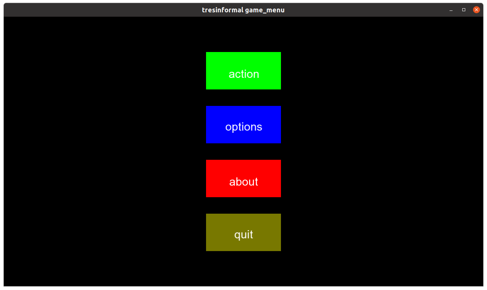
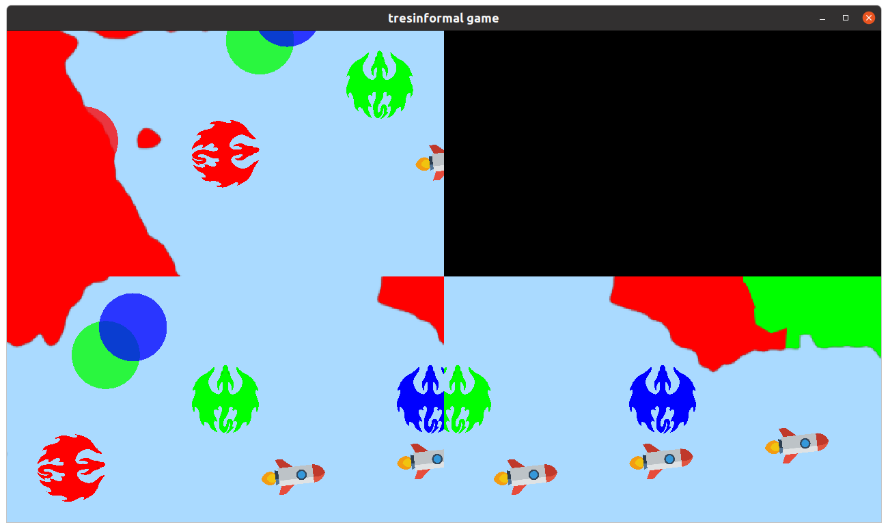
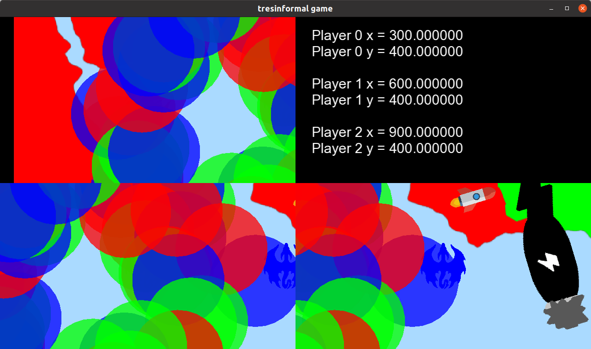
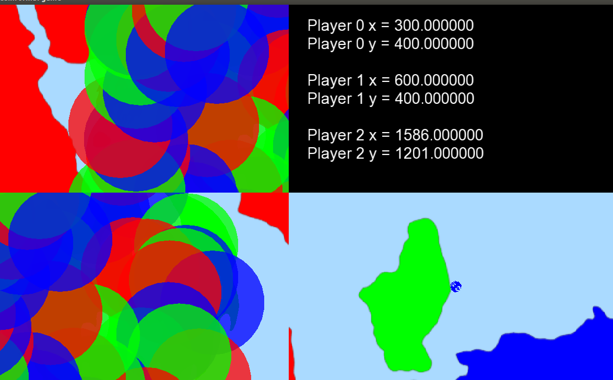

# drakkar

Branch      |[GitHub Actions](https://github.com/tresinformal/drakkar/actions)                                       |
------------|-----------------------------------------------------------------------------------------------------|-------------------------------------------------------------------------------------------------------------------------------------------------------
`master`    |   |
`develop`   |  |
`claudio`   |     |
`maedas`    |     |
`jacob`     |   |
`jayjay`  |   |
`ludvig`    |   | 
`mahsa`    |   |
`oliver`    |    |
`oscar`     |    |
`pavel`     |    |
`richel`    |   |
`richel2`   |   |
`sebastian` ||
`stefano`   |  |
`theo`      |     |
`tianjian`  |   |

 * Branches are ordered `master`, `develop`, then topic branches alphabetically
A video game, developed informally and professionally.

## Meetings

 * Date: Weekly, every Wednesday
 * Time: 17:00-19:00
 * Where:
    * In Uppsala: Uppsala Makerspace, Ekeby Bruk 6M, [https://www.uppsalamakerspace.se/](https://www.uppsalamakerspace.se/)
    * In Groningen: Franjo's Fancy Coffee Room
    * On Discord, see [FAQ](faq.md)

We follow this timetable:

Where|What              | Time
-----|------------------|------
U    |Order pizza       | 16:00
GOU  |Doors open        | 17:00
GOU  |Session starts    | 17:15
GOU  |Break time!       | 18:00
GOU  |Session continues | 18:15
GOU  |End of lesson     | 19:00

 * `[G]` denotes 'at Groningen'
 * `[O]` denotes 'online'
 * `[U]` denotes 'at Uppsala'

## Code of Conduct

See [CODE_OF_CONDUCT.md](CODE_OF_CONDUCT.md).

In case it is undesirable to email Richel,
contact [Stefano 'swom' Tiso](https://github.com/swom).

## drakkar.io: 2D PvP chasing game

Drakkar is a multiplayer game featuring dragons of different colours trying to chase and eat one another. The game resembles agar.io, with the addition of a Rock-Paper-Scissor dynamic via the RGB colours.

The goals and rules of the game are described in the [Design Doc](https://github.com/tresinformal/
drakkar/blob/master/doc/game_design.md). Before contributing, first make sure you are familiar with it.
We aim to make the design described in the doc come to life, and should refrain from working on things that do not fall in its scope. Any new feature or idea should be discussed first, then if received positively should be included in the design doc. 

## [Installation](install.md)

See [install.md](install.md).

## Links

https://agar.io/, this game could give a good idea of how we would like this game to work. The game we think about though should allow more variation in determining how you grow and/or change shape, as well as could require different conditions than just being bigger than the other player to eliminate it.

## Short-term schedule

Next meeting:

Timespan    |Activity
------------|--------------------------------------------------------------------------
17:00       |Door opens
..          |Do Issues
17:45-18:00 |Break
..          |Do Issues

 * Note that `xx` and the other variables can be in range `00` to and including `59`. 

## Long-term schedule

Date       |Activity
-----------|--------------------------------------------------------------------------
2021-02-17 |practice git branching
2021-02-17 |fixing tests
2021-04-28 |merge to develop by code reviewed Pull Request
.          |pair programming
.          |move to C++14
.          |add clang tidy

## [Frequently Asked Questions](faq.md)

See the [FAQ](faq.md).

## Screenshots

Most recent at the top.

 

Hi, how are things
