# game

Branch     |[GitHub Actions](https://github.com/tresinformal/game/actions)                                       |
-----------|-----------------------------------------------------------------------------------------------------|-------------------------------------------------------------------------------------------------------------------------------------------------------
`master`   |   |
`develop`  |  |
`clem`     |     |
`gina`     |     |
`kristiina`|  |
`pavel`    |    |
`richel`   |   |
`sebastian`||
`swom`     |  |
`theo`     |     |
`xiaoyan`  |  |

 * Branches are ordered `master`, `develop`, then topic branches alphabetically

A video game, developed informally and professionally.

## Coding via Discord

We developing our game, while chatting on Discord.
To join, send Richel a Discord Friend Request: `richelbilderbeek#9002`.
He'll add you to the tresinformal server.

Our Discord server has mostly obvious rules that follow from the categories:

 * 4x 'Group Rooms': rooms for duos/triplets, open for questions
 * 2x 'Offices With An Open Door': single room, open for questions
 * 2x 'Offices With A Closed Door': single room, please do not disturb

One rule that needs to be written down, however, is that members 
are never allowed to silence another member, not even as a joke.

See this video for an introduction: [YouTube](https://youtu.be/zyn5VyNjz5I) [download (.OGG)](http://richelbilderbeek.nl/dutch_by_kids_students.ogv)

## Meetings

 * Date: Weekly, every Wednesday
 * Time: 17:00-19:00
 * On Discord

We follow this timetable:

What             | Time
-----------------|------
Doors open       | 17:00
Lesson starts    | 17:15
Break time!      | 18:00
Lesson continues | 18:15
End of lesson    | 19:00

## Code of Conduct

See [CODE_OF_CONDUCT.md](CODE_OF_CONDUCT.md).

In case it is undesirable to email Richel,
contact [Stefano 'swom' Tiso](https://github.com/swom).

## Game: 2D PvP chasing game

A game where you are on a 2D surface with heterogeneous characteristics, as different terrains, resources etc. You start with a very small particle-like character, as you play you can gather resources scattered around and increase your size/mass, the more you grow the more your options increase(you can change shape, what matter composes you etc.), other players roam around as you do increasing size and having more options as they progress. The goal is to chase and eliminate the other players. It would be good to have multiple conditions(you have to be bigger, you need to be made of a certain material etc.) you need to satisfy to be able to eliminate the other players.e.

## [Installation](install.md)

See [install.md](install.md).

## Links

https://agar.io/, this game could give a good idea of how we would like this game to work. The game we think about though should allow more variation in determining how you grow and/or change shape, as well as could require different conditions than just being bigger than the other player to eliminate it.

## Short-term schedule

Next meeting:

Timespan    |Activity
------------|--------------------------------------------------------------------------
17:00       |Door opens
..          |Do Issues
17:45-18:00 |Break
..          |Do Issues

 * Note that `xx` and the other variables can be in range `00` to and including `59`. 

## Long-term schedule

Date       |Activity
-----------|--------------------------------------------------------------------------
2021-02-17 |practice git branching
2021-02-17 |fixing tests
2021-04-28 |merge to develop by code reviewed Pull Request
.          |pair programming
.          |move to C++14
.          |add clang tidy

## I am a newbie developer. What must I do?

Welcome to the team! Here is a more-or-less-chronological (i.e. if you
get stuck, start working on the next one) list of what to do:

 * [Become a tresinformal team member](https://github.com/tresinformal/game/issues/1)
 * [Install Qt Creator and SFML](https://github.com/tresinformal/game/issues/16)
 * [Modify README.md on master branch](https://github.com/tresinformal/game/issues/19)
 * [Make a branch for yourself via the GitHub web interface](https://github.com/tresinformal/game/issues/47)
 * [Modify README.md on your local harddrive on your own branch](https://github.com/tresinformal/game/issues/48)
 * [Add your branch's badges to the README.md](https://github.com/tresinformal/game/issues/87)

When you feel comfortable with the workflow, you become a junior developer!

## I am a junior developer, what should I do?

Junior developers are those that feel comfortable enough with the workflow
to write their own tests. Next to programming, juniors will
occasionally teach newbies.

You will be practicing:

 * Team development workflow
 * git an GitHub
 * C++ and SFML entry level development

Start from an idea of a visible change in the game,
for example, 'The players should be able to do a little dance'.
Create an Issue for that and assign yourself to it
Work from big to small, in TDD fashion.

For a big Issue:

 * Postpone the hard work, create simpler and simpler tests, 
   until a test can be fixed by a small Issue.
 * Do push the #IFDEF-ed tests

For a small Issue:

 * Write a test that breaks the build
 * Make the test pass
 * Push to GitLab

Golden rules:

 * Whatever you work on, always be assigned to an Issue
 * Whatever code you develop, always be working to fix a test,
   unless you work on graphics
 * If all tests pass, we are -by definition- happy

## I am a medior developer, what should I do?

A medior developer 

 * writes tests and creates Issues for juniors and themselves
 * does code reviews
 * works on more complex issues, such as improving the architecture of
   the code or improving the continuous integration tools (whatever those are :-))
 * see the bigger picture of the code and the team.

You know what to do :+1:

## Screenshots

Most recent at the top.

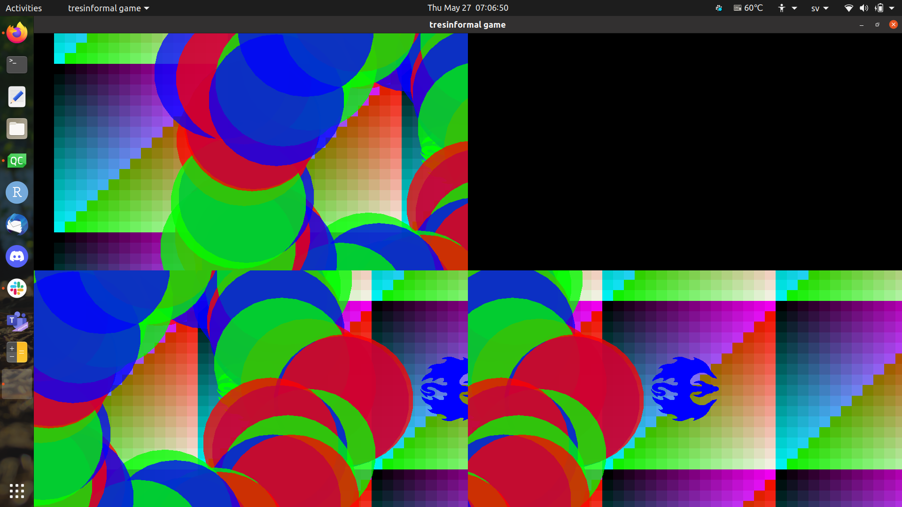

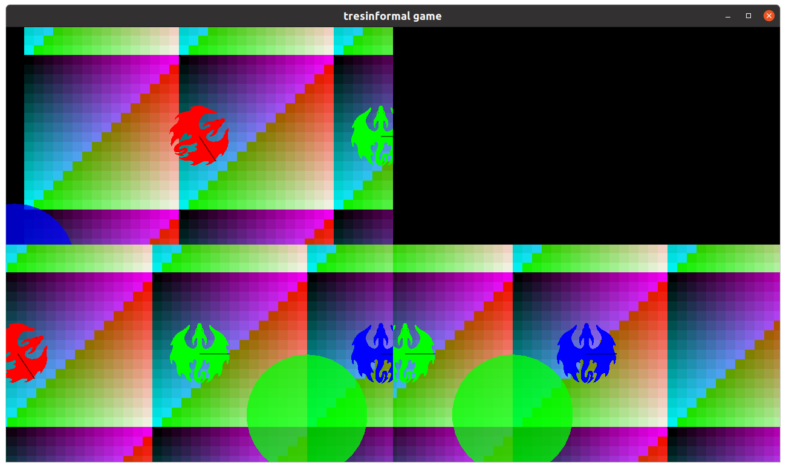

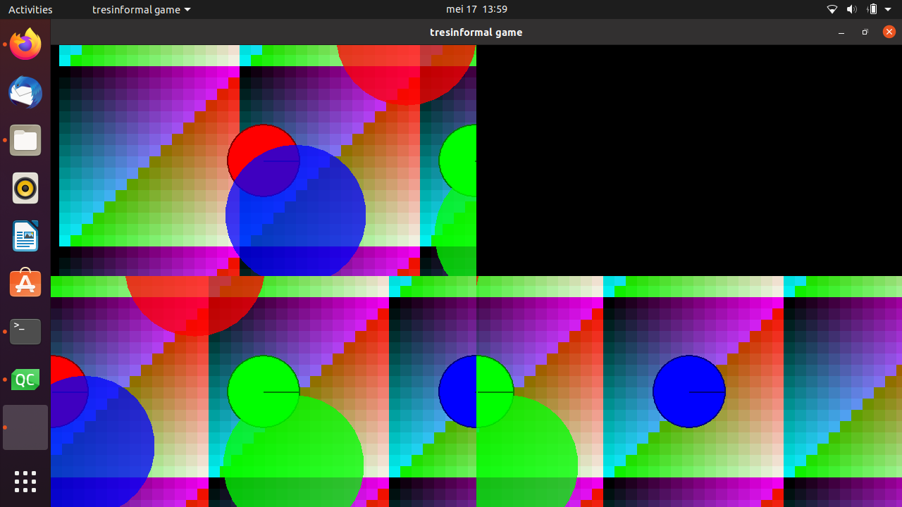

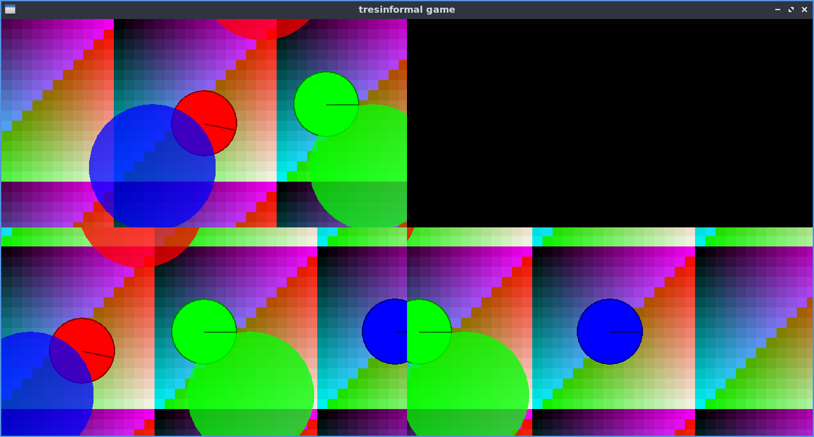

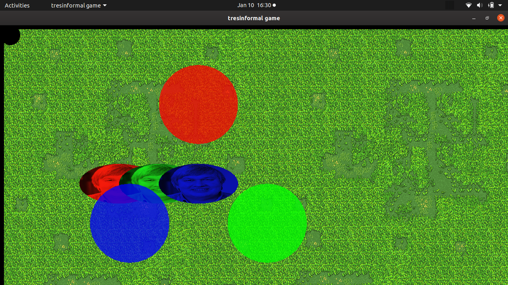

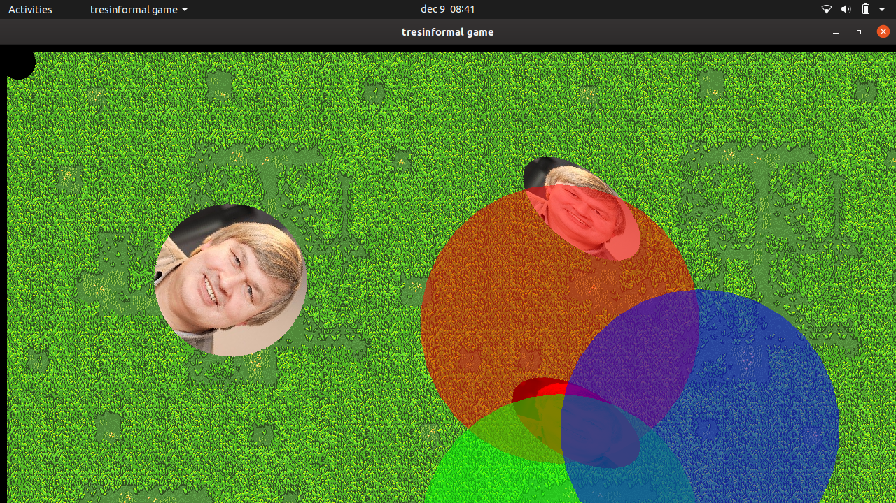

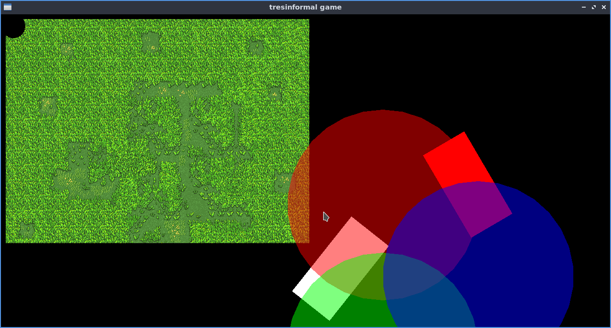

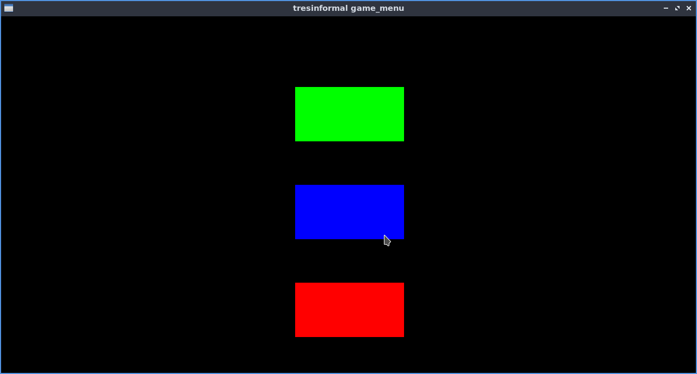

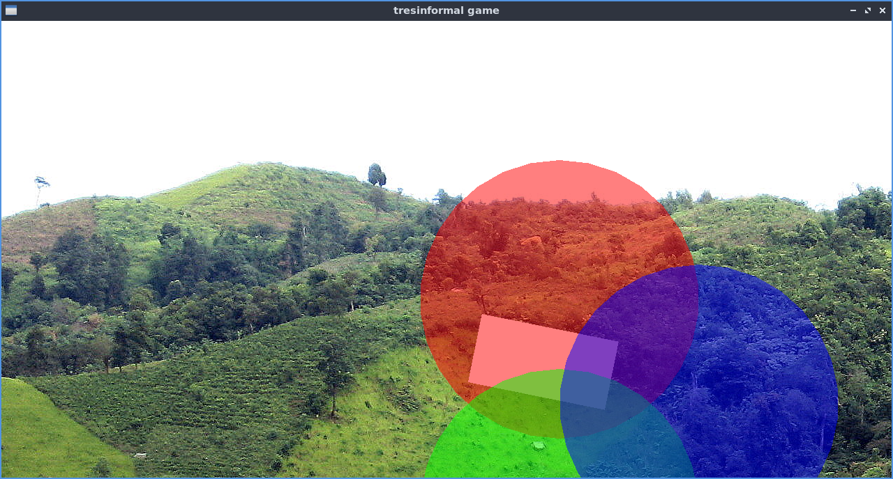

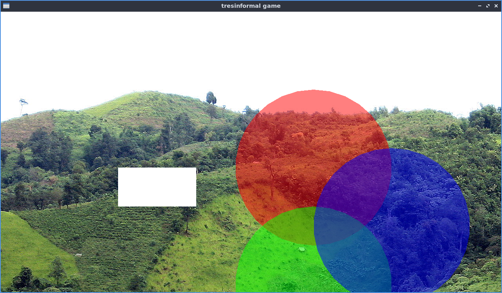

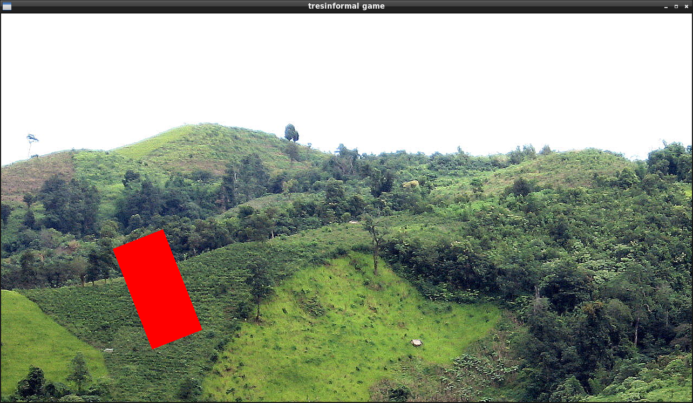 

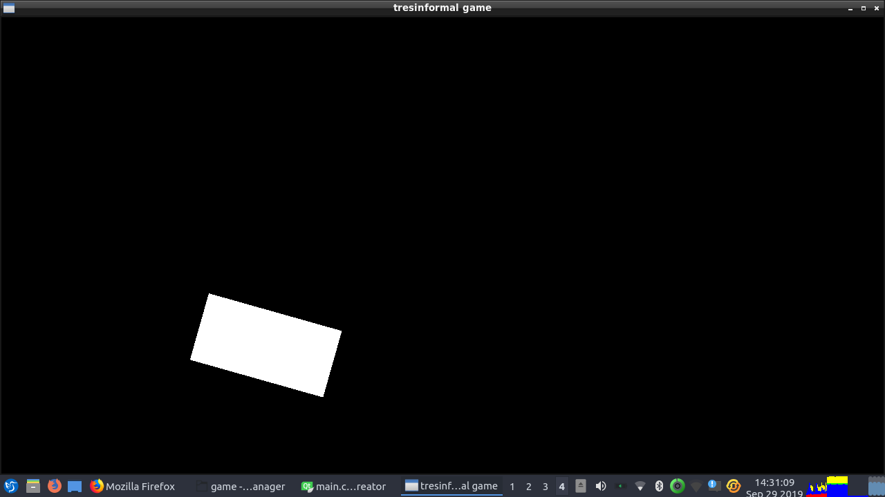

<<<<<<< HEAD
=======

>>>>>>> develop
