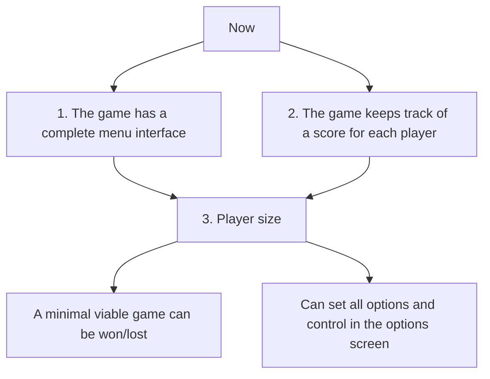

# Roadmap

 1. [The game has a complete menu interface](https://github.com/tresinformal/game/milestone/1)
 2. [The game keeps track of a score for each player](https://github.com/tresinformal/game/milestone/2)
 3. [Player size](https://github.com/tresinformal/game/milestone/3)

