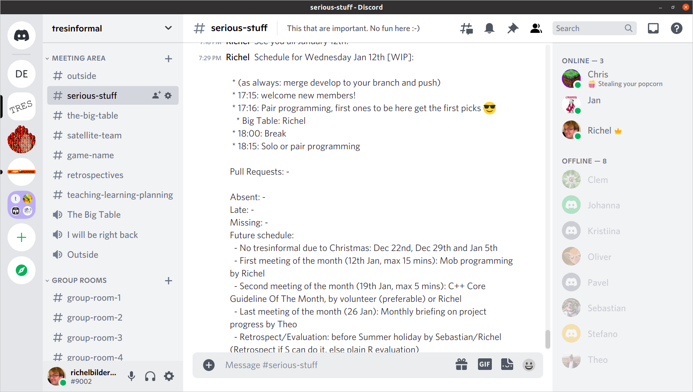

# FAQ

 * Joing
 * Team rules
 * Who is in the team?
 * Do I need to know C++ before joining?
 * Do I need to be present every meeting?
 * Do I need to work on the game in my free time?
 * How to contact the team?
 * How is Discord used?
 * I am a newbie developer. What must I do?
 * I am a junior developer, what should I do?
 * I am a medior developer, what should I do?
 * What is the 4x4 rule?
 * How do I leave the team?

## I want to join the team. What must I do?

Awesome!

To join the team, you will need:

 * To have a desktop or laptop computer
 * To have a GitHub account (free)
 * To have a Discord account (free)
 * Be able to speak English
 * Be able to type

Just contact one of the members (see 'How to contact the team?')!

Things you may wonder:

 * You do not need to know C++: the team will teach you
 * You will not need to be present every meeting. It is appreciated to let
   the team know you will be absent. You do not need to give a reason for
   your absence: we trust you do something useful/fun :-)
 * There is no 'homework': we work only when we can and want to

## Who is in the team?

Active team members have their own git branch (whatever a git branch is :-) ),
so [https://github.com/tresinformal/drakkar#drakkar](https://github.com/tresinformal/drakkar#drakkar)
gives a nice overview of all team members.

## Do I need to know C++ before joining?

Nope, the team will teach you.

## Do I need to be present every meeting?

Nope, you will not need to be present every meeting. 

It is appreciated to let
the team know you will be absent. You do not need to give a reason for
your absence: we trust/hope you do something useful/fun :-)

## Do I need to work on the game in my free time?

Nope, there is no 'homework': we work only when we can and want to.

## How to contact the team?

 * Send Richel (or any team member) a Discord Friend Request: `richelbilderbeek#9002`
 * Send Richel (or any team member) an email: `richel@richelbilderbeek.nl`
 * Post at the GitHub Issue [Become a tresinformal team member](https://github.com/tresinformal/drakkar/issues/1)

## How is Discord used?

We develop our game, while chatting on Discord.

To join, send Richel (or any team member) a Discord Friend Request: `richelbilderbeek#9002`.
He/she will add you to the `tresinformal` Discord server.

Our Discord server has mostly obvious rules that follow from the categories:

 * 'the-big-table': here we gather
 * 'serious-stuff': serious stuff, mostly schedules and results from meeting
 * 'outside': here we go in the breaks
 * 4x 'Group Rooms': rooms for duos/triplets, open for questions
 * 2x 'Offices With An Open Door': single room, open for questions
 * 2x 'Offices With A Closed Door': single room, please do not disturb

One rule that needs to be written down, however, is that members 
are never allowed to silence another member, not even as a joke.

See this video for an introduction: [YouTube](https://youtu.be/zyn5VyNjz5I) [download (.OGG)](http://richelbilderbeek.nl/dutch_by_kids_students.ogv)

## I am a newbie developer. What must I do?

Welcome to the team! Here is a more-or-less-chronological (i.e. if you
get stuck, start working on the next one) list of what to do:

 * [Become a tresinformal team member](https://github.com/tresinformal/drakkar/issues/1)
 * [Install Qt Creator and SFML](https://github.com/tresinformal/drakkar/issues/16)
 * [Modify README.md on master branch](https://github.com/tresinformal/drakkar/issues/19)
 * [Make a branch for yourself via the GitHub web interface](https://github.com/tresinformal/drakkar/issues/47)
 * [Modify README.md on your local harddrive on your own branch](https://github.com/tresinformal/drakkar/issues/48)
 * [Add your branch's badges to the README.md](https://github.com/tresinformal/drakkar/issues/87)

When you feel comfortable with the workflow, you become a junior developer!

## I am a junior developer, what should I do?

Junior developers are those that feel comfortable enough with the workflow
to write their own tests. Next to programming, juniors will
occasionally teach newbies.

You will be practicing:

 * Team development workflow
 * git and GitHub
 * C++ and SFML entry level development

Start from an idea of a visible change in the game,
for example, 'The players should be able to do a little dance'.
Create an Issue for that and assign yourself to it
Work from big to small, in TDD ('Test-Driven Development') fashion.

For a big Issue:

 * Postpone the hard work, create simpler and simpler tests, 
   until a test can be fixed by a small Issue.
 * Do push the #IFDEF-ed tests

For a small Issue:

 * Write a test that breaks the build
 * Make the test pass
 * Push to GitLab

Golden rules:

 * Whatever you work on, always be assigned to an Issue
 * Whatever code you develop, always be working to fix a test,
   unless you work on graphics
 * If all tests pass, we are -by definition- happy :)

## I am a medior developer, what should I do?

A medior developer 

 * writes tests and creates Issues for juniors and themselves
 * does code reviews
 * works on more complex issues, such as improving the architecture of
   the code or improving the continuous integration tools (whatever those are :-))
 * see the bigger picture of the code and the team.

You know what to do :+1:

## What is the 4x4 rule?

The 4x4 rule is the following rule:

If at 4 subsequent meetings, there were less than 4 other team members at the start, Richel leaves.

The goal of the rule is to determine when the team has gotten awkwardly small
and should be dissolved. Of course, someone else can take over the lead,
but this has never happened until now (see e.g. [the informalr team](https://github.com/informalr)).

## How do I leave the team?

Just let a team member know. You do not need to give a reason:
we trust/hope you do something else useful/fun :-)

You will be contacted to verify we can:

 * remove you from the Discord `tresinformal` server
 * delete your git branch

After that, you will be removed from the Discord `tresinformal` server
and your git branch will be deleted.

You will always be welcome to join the team again in the future!

